# Writeup

## 1 Choosing a dataset to explore

I found https://vincentarelbundock.github.io/Rdatasets/articles/data.html which allowed me to sort by number or rows and columns. At this point I chose my data based on the percieved "richness" of the data. So I sorted by rows and looked through a few csvs until I found one that had a good amount of columns that seemed to encode distinct information (as opposed to very similar or the same information).

## 2 Data Parsing

The first step of this was to clean the data. I had some parsing issues, and many missing values. Some of the missing values were due to parsing issues which I solved.

  
  
  
Parsing issues and missing values.

## 2.5 Data Cleaning

A lot of the missing values besides `a` and `b` were an absence of opinions on aborition data, which we don't want bc that's the point so I removed rows that had miissing vlues for a gneneral opinoin on abortion and it helped. It was ok for missing vvalues for `a` and `b` because that just means "maybe" or "unknown" but it is auxiliary? data - not necessary for what we are measuring. would be nice if it was more tho.

  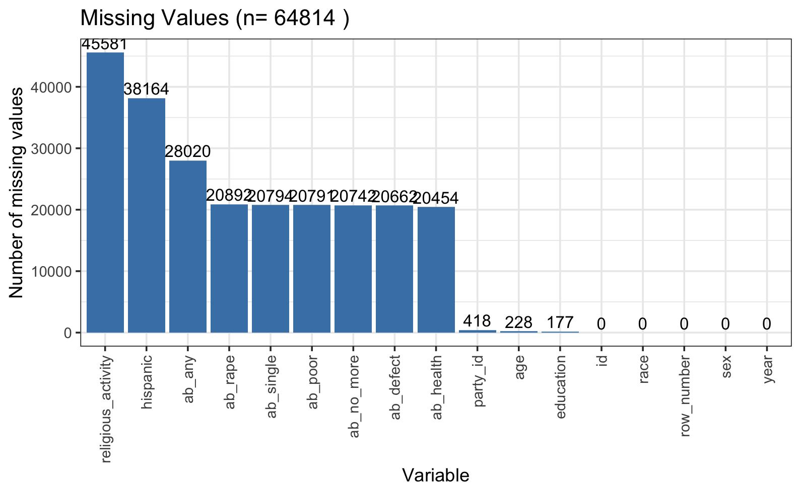
  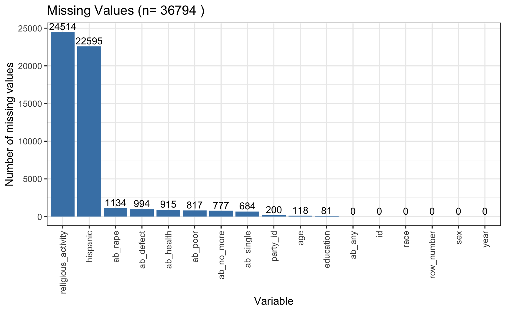

  
Missing values before and after removing rows with <code>NA</code> for <code>ab_any</code>

## 3 R

  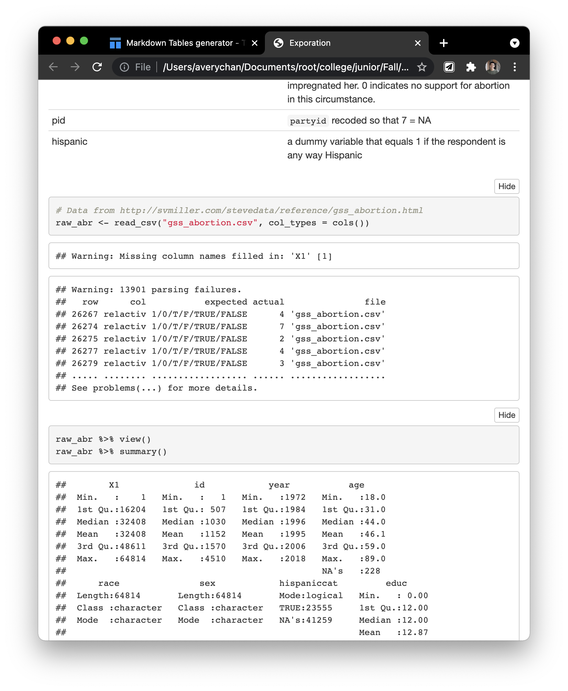
  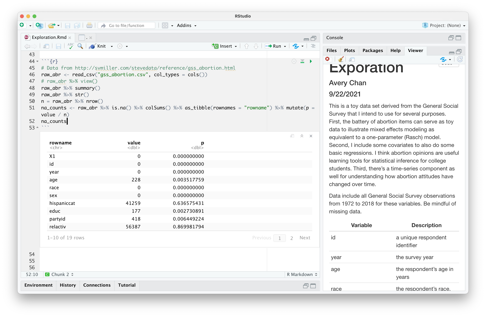
  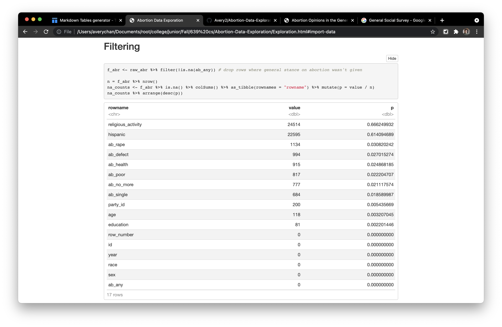

  
Words go here.

## 4 Missing Values

  
  
  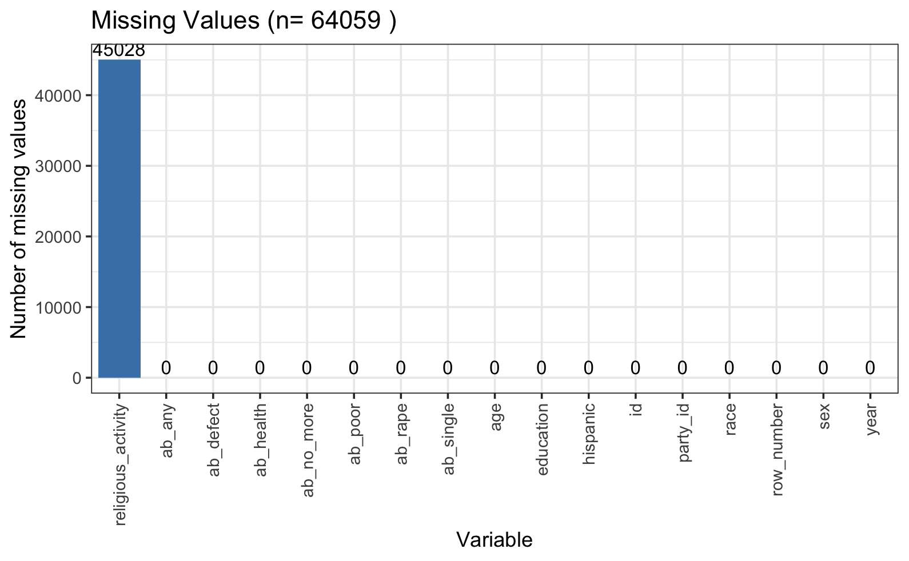

  
Words go here.

## 5 Missing Questions

  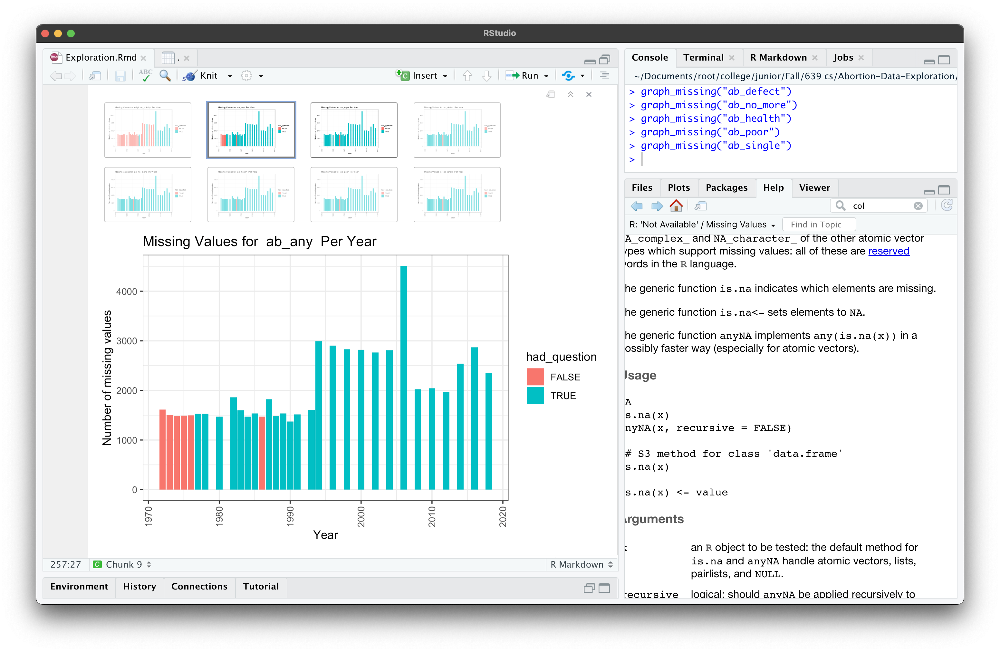
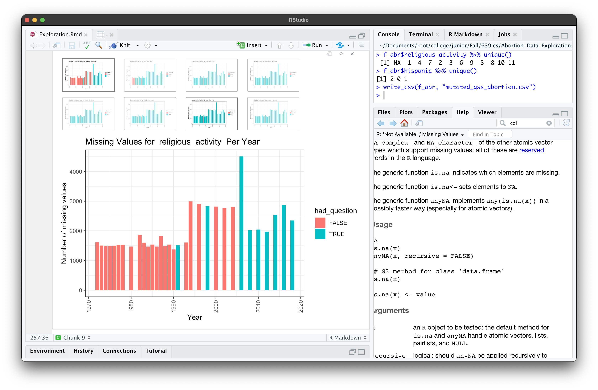
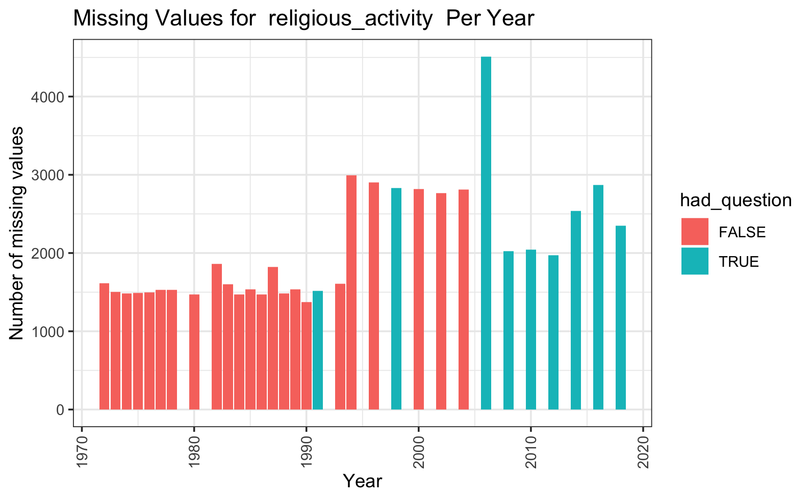

  
Words go here.

## 6 Missing Questions Pt. 2

  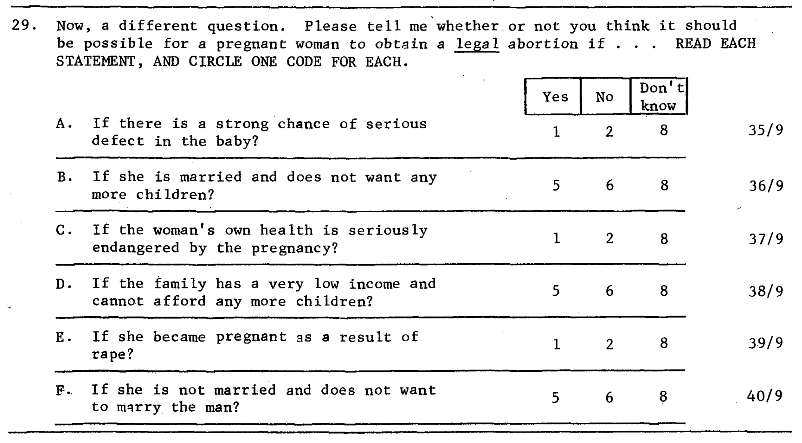
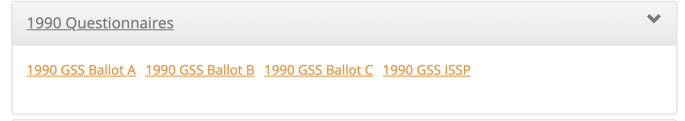
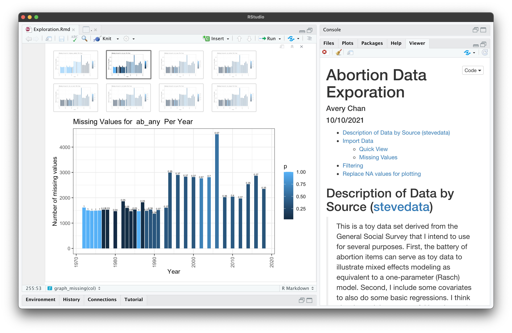
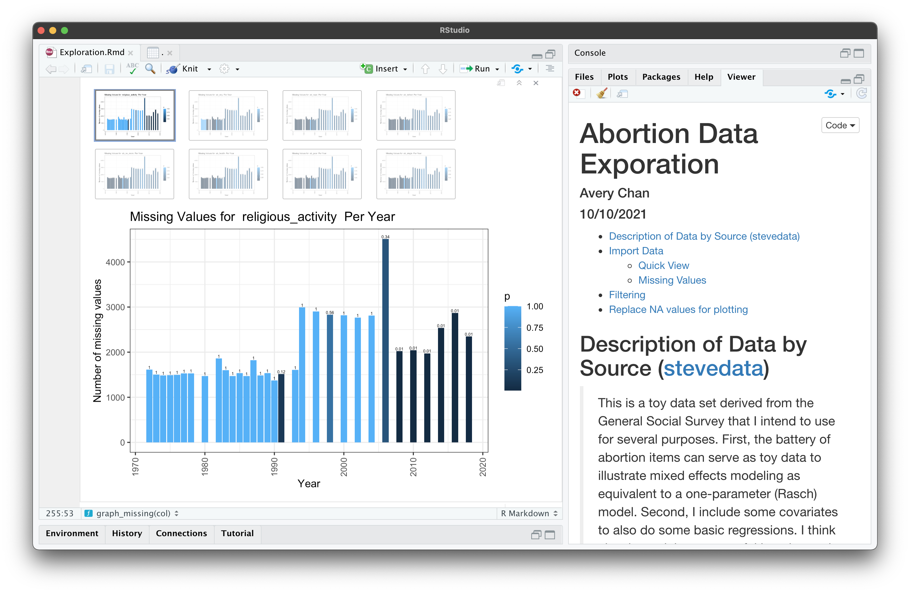

  
Words go here.

## 7 Correlations

  

  
Words go here.

